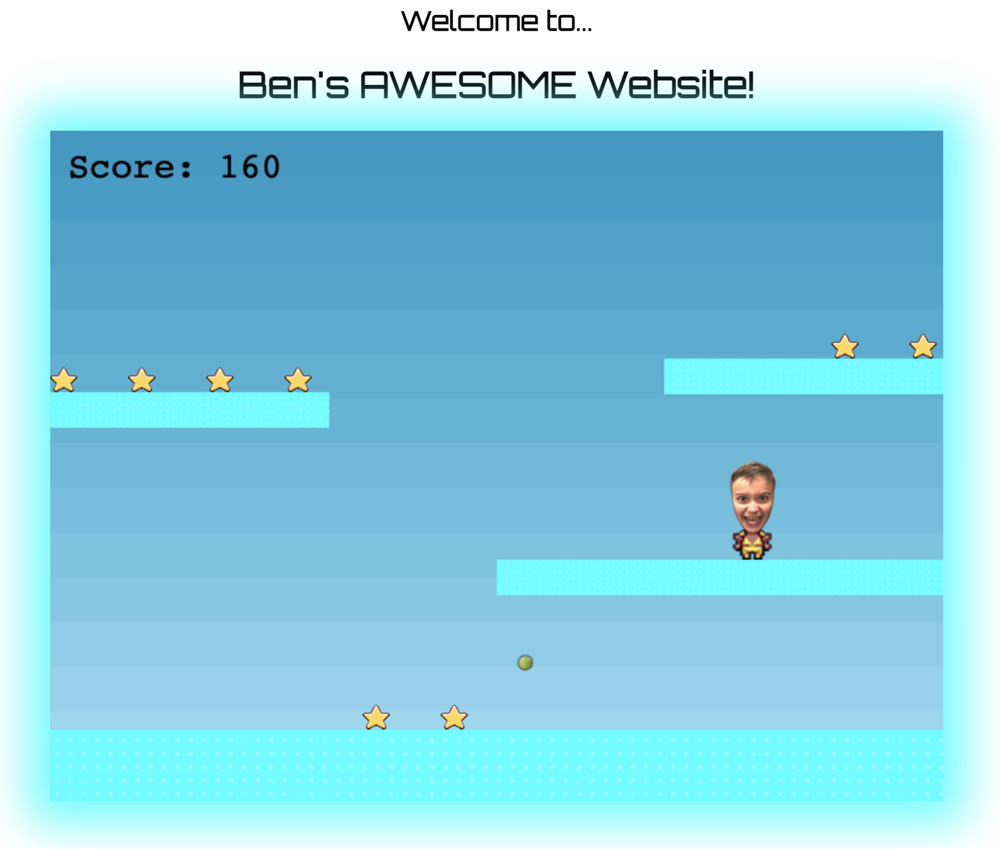

# ben-website

Ben vs. the Peas is a retro-style platformer where young Ben battles his ultimate nemesis — flying peas! Dash, jump, and grab as many stars as you can before those pesky veggies ruin your day.



## How to Run

1. Install dependencies:
   ```bash
   npm install
   ```

2. Start the server:
   ```bash
   PORT=3000 npm start
   ```

3. Open your browser and navigate to:
   ```
   http://localhost:3000
   ```

4. Use arrow keys to play the game:
   - Left/Right arrows: Move Ben
   - Up arrow: Jump
   - Down arrow: Fast fall
   - Collect stars and avoid peas!
